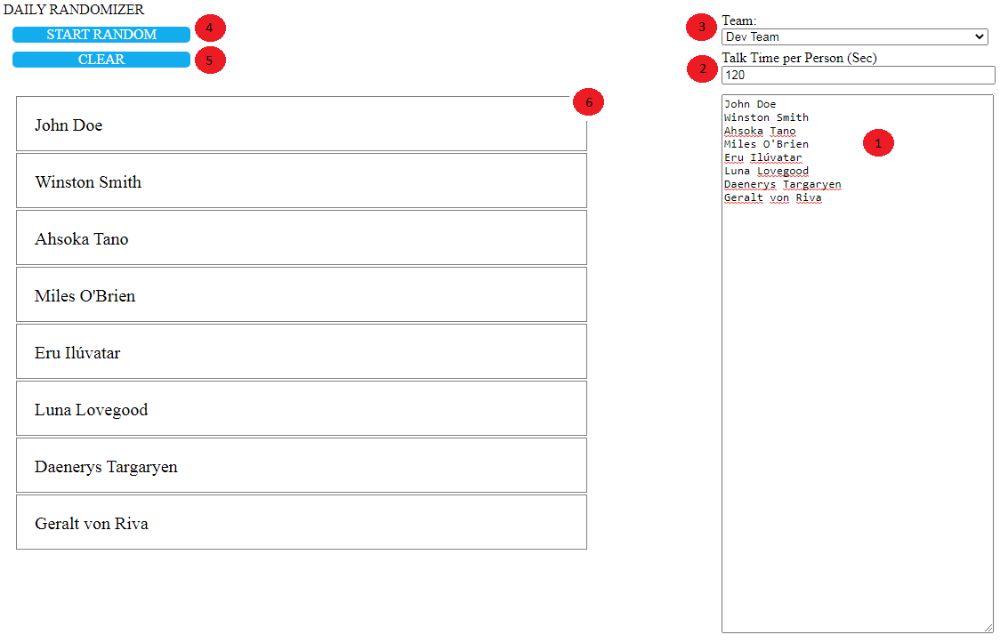

# Daily Randomizer #

This Tool is able to prevent you from awkward silence. Instead of "who wants to start?", just ask the tool :)
<br>
Try it:
[github.io](https://frogger1993.github.io/daily/)

## How to use the tool ##

1) This is the "persons list". Add or remove here the users of your meeting. Enter here 1 person per line.
2) Optional - timer for the talk time per person. If not wanted please enter "-1" or just ignore it.
3) Optional - Dropdown to preselect a stored team. If the user selects something in the dropdown the persons list will be replaced by the stored one. Can be configured via "assets/names.json".
4) Button to start random selection. When hitting a dot in the "persons selection" appears and selects somebody.
5) Button to clear already selected persons (reset)
6) "persons selection":
    - a green dot indicates the currently selected person
    - timer countdown
    - green background indicates already selected

## Setup ##
This is an Angular project.
- Local Setup
    - Install NodeJs and Angular
    - (Optional) change assets/names.json according "Configure" Section
    - Run "npm ci" (installing all required dependecies)
    - Run "npm start" or "ng serve" (starts the application on port 4200)
    - Open browser "localhost:4200"
- Server (Kubernetes/Tomcat/...)
    - Install NodeJs and Angular
    - (Optional) change assets/names.json according "Configure" Section or inject the storage/config later in your runtime
    - Run "npm ci" (installing all required dependecies)
    - Run "ng build --prod --aot --optimization --outputHashing=all --outputPath www"
    - Copy "www" folder into your webserver

## Configure ##
You can configure the stored teams for the dropdown (3). Therefore you have to change assets/names.json.
The json consists out of an array of "team objects". In every "team object" you can specify a title and the persons as string array.
Example:

```json
[
  {
    "title": "Test Team",
    "persons": [
      "Test0",
      "Test1",
      "Test2",
      "Test3"
    ]
  },
  {
    "title": "Test Team 2",
    "persons": [
      "Test0",
      "Test1",
      "Test2",
      "Test3"
    ]
  }
]
````


